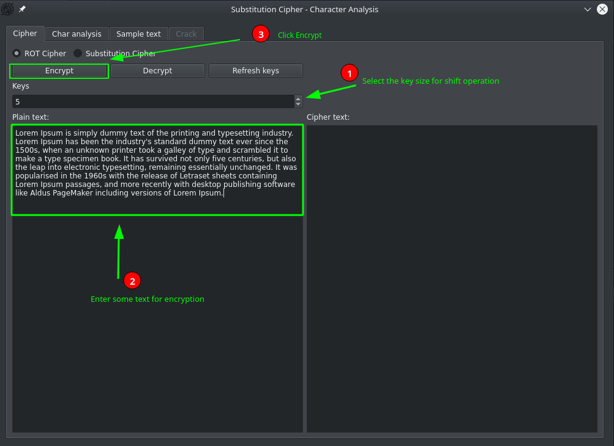
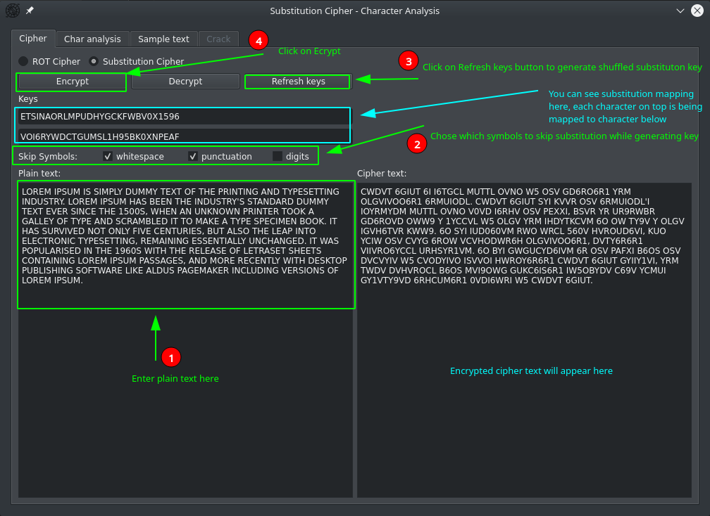
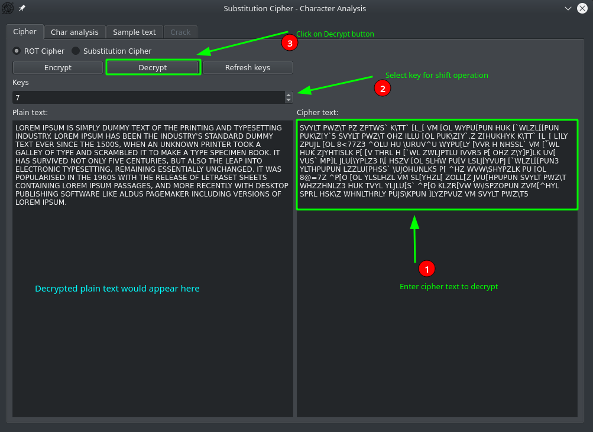
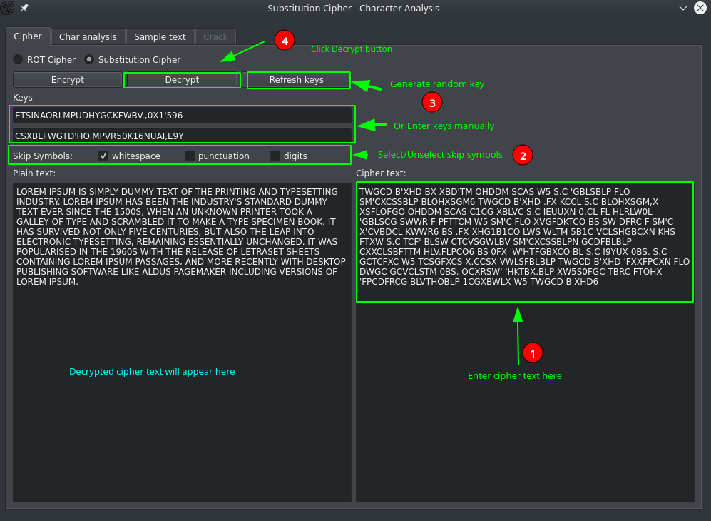
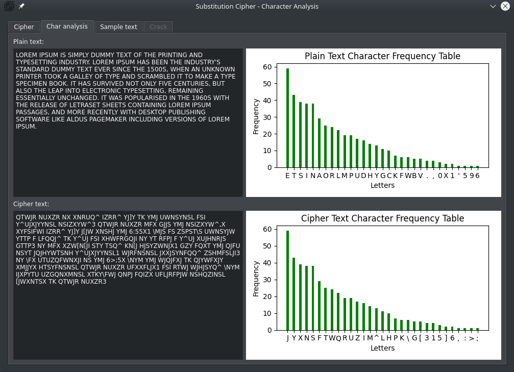
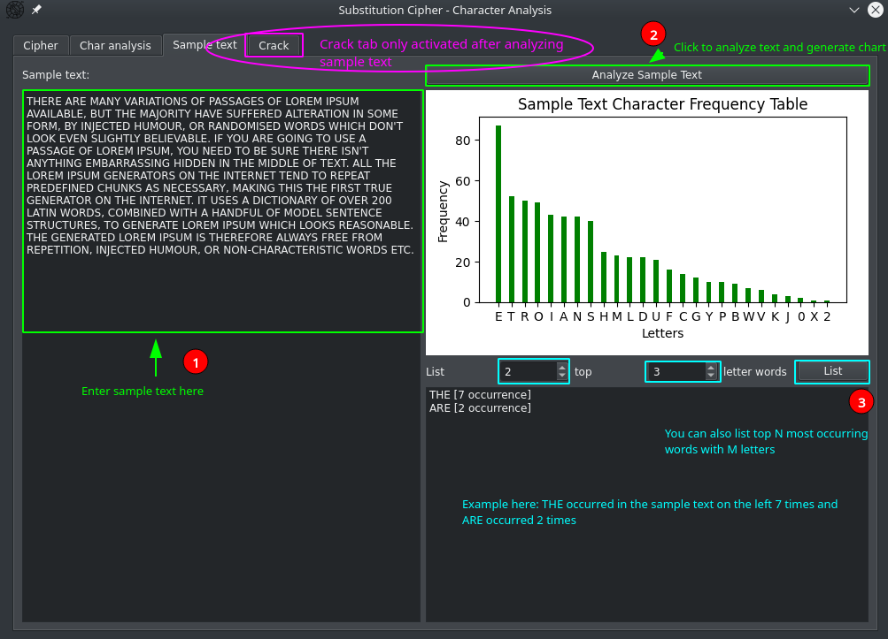
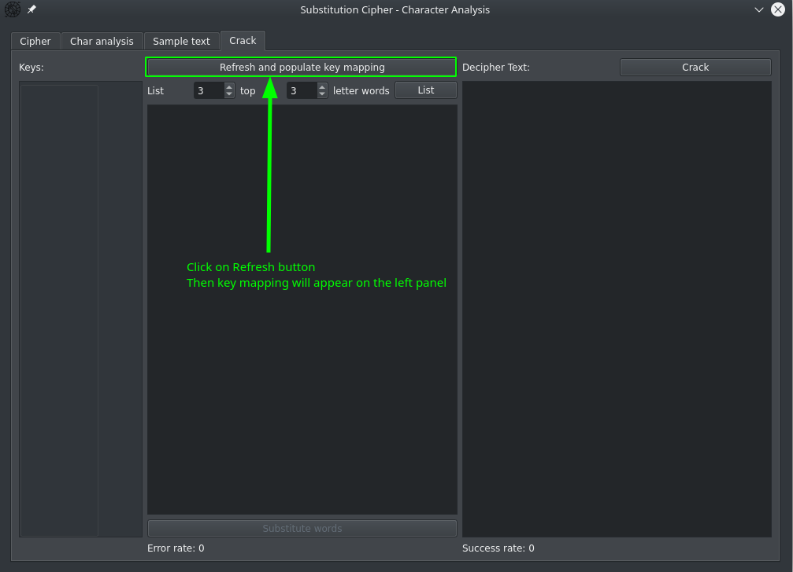
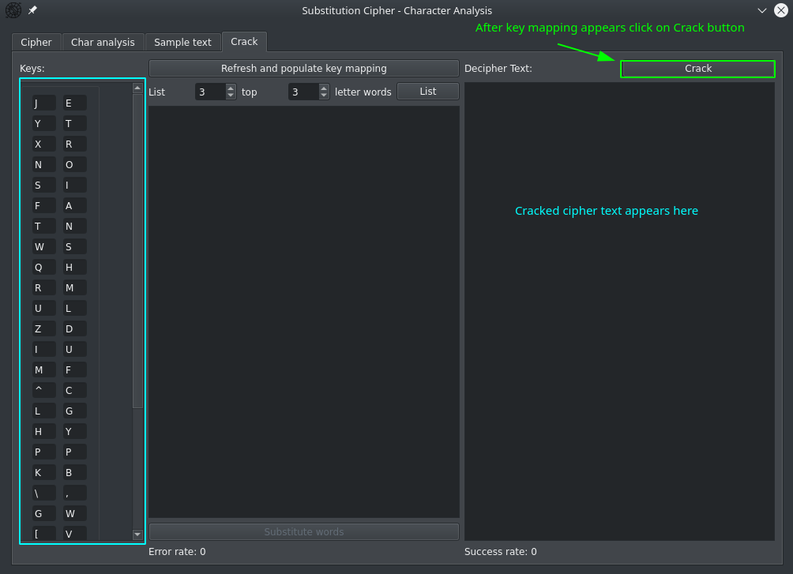
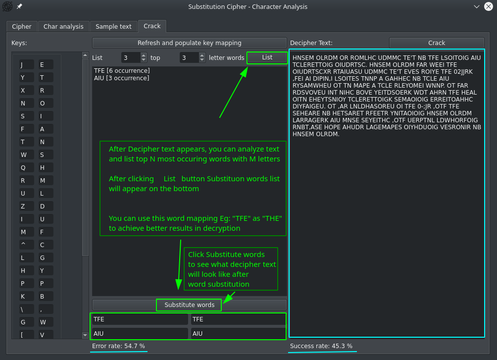
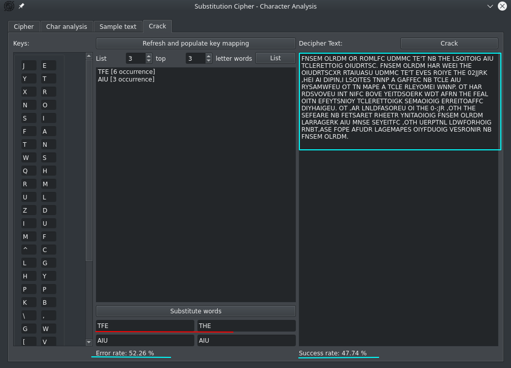

*****
Substitution Cipher
*****

Substitution cipher is a type of encryption method that replaces each letter
of the plaintext with another letter or symbol to create a secret message.
This project aims to implement a substitution cipher in Python programming
language and apply it to encrypt and decrypt messages.

`Learn more on Wiki <https://en.wikipedia.org/wiki/Substitution_cipher>`.

---------------

Setup
=====
Run setup
::

    pip install .

---------------

RUN
=====
Run main script after requirements setup
::

    python substitution-cipher/main.py

---------------

Usage
=====

Encryption
**********************

    How to Encrypt with ROT cipher

    How to Encrypt with Substitution cipher

Decryption
**********************

    How to Decrypt with ROT cipher

    How to Decrypt with Substitution cipher

Char analysis
**********************

    Char Analysis - shows letter frequency chart

Sample text analysis
**********************

    Sample Text Analysis - used for obtaining char frequency mapping (for crack)

Cracking with sample text's character frequency
**********************

* Step 1

Click on "Refresh and populate key mapping" button to obtain key mapping
from `cipher text` (1st tab) and `sample text` (3rd tab)

    Cracking - first step

^^^^^^^^

* Step 2

Key mapping on the left panel will appear. After that click on `Crack` button to get
cracked cipher text from `sample text's` frequency mapping

    Cracking - second step

^^^^^^^^

* Step 3

You can see on the right panel deciphered text.
Also you can make additional analysis on frequent occurring words and substitute words
like AND, THE, AN, IS, OF ..etc.

    Cracking - third step

^^^^^^^^

* Final Result

You can see overall result after word substitution. Success and error rate,
(which are calculated by comparing `decipher text` character-by-character
with the original `plain text`), can decrease or increase depending on correct mapping

    Cracking - final result
